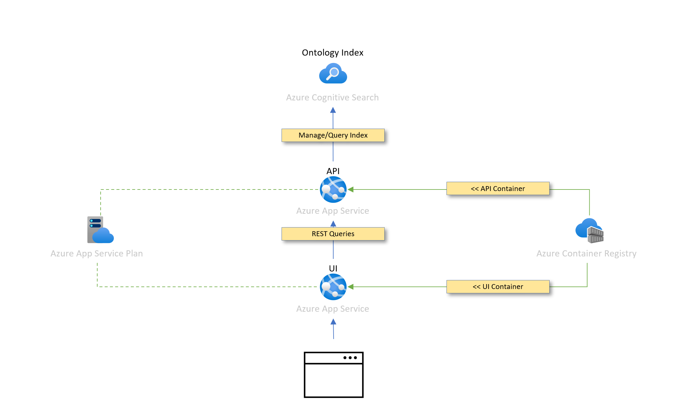

# Azure Digital Twins Ontology Browser

The Azure Digital Twins Ontology Browser sample comprises of two web applications (ui and api) and azure cognitive search. When deployed this application allows users to Search, Browse and Vizualize Open Source Digital Twins ontologies found on Github.

## Contents

| Directory | Description |
|----------|-------------|
| [src/ui](./src/ui/README.md) | The UI application |
| [src/api](./src/api/README.md) | The API application |
| [deployment](./deployment/README.md) | Deployment instructions |

## Getting Started

To deploy the required resources for the sample by following the instructions in the [deployment](./deployment/README.md) directory.

This will deploy the following architecture into a resource group of your choice.

You will then be able to navigate to the application and see the results of the ontology indexing.

The Architecture above Searches [Github](https://github.com/search?q=opendigitaltwins-&type=repositories) for Open Ontologies "opendigitaltwins-" and indexes all the [dtdl](https://github.com/Azure/opendigitaltwins-dtdl/blob/master/DTDL/v2/dtdlv2.md) found in these ontologies using [Azure Cognitive Search](https://azure.microsoft.com/en-gb/services/search/#overview). These Ontolgies are then made searchable and browsable via an api which the React Browser App comminicates with.

